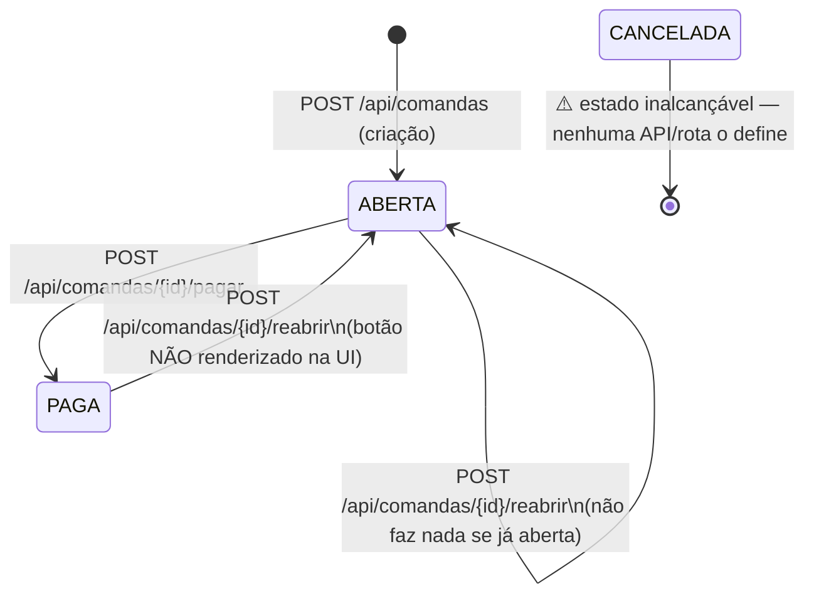

# Estados da Comanda — Mapa e Transições

Documentação dos estados possíveis de uma `Comanda` e como cada um é alcançado,
com base no código atual (schema Prisma, rotas de API e telas do admin).

## 1. Estados definidos

O enum `StatusComanda` em `prisma/schema.prisma` define **3 estados**:

| Estado     | Rótulo na UI | Cor      | Observação                                        |
|------------|--------------|----------|---------------------------------------------------|
| `ABERTA`   | Aberta       | azul     | Valor **padrão** ao criar (`@default(ABERTA)`)    |
| `PAGA`     | Paga         | verde    | Terminal: comanda liquidada                       |
| `CANCELADA`| Cancelada    | vermelho | Definida no enum e nas UIs, mas **nunca escrita** |

Campos auxiliares que acompanham o ciclo de vida (`prisma/schema.prisma`, model `Comanda`):

- `status StatusComanda @default(ABERTA)`
- `codigoRecibo String? @unique` — gerado só para **convidados** (sem `clienteId`)
- `fechadaEm DateTime?`
- `pagaEm DateTime?`
- `formaPagamentoId`, `quantidadeParcelas`

## 2. Diagrama de transições

## 3. Como chegar em cada estado

### `ABERTA` (inicial)
- **Criação** — `POST /api/comandas` (`src/app/api/comandas/route.ts`).
  - Requer `itens` não vazio; resolve preços, valida/desconta estoque e cria a comanda.
  - Status sai `ABERTA` por default do Prisma (não é setado explicitamente).
  - Se **não há** `clienteId` (convidado), gera um `codigoRecibo` de 6 caracteres (alfabeto sem ambiguidades: `ABCDEFGHJKMNPQRSTUVWXYZ23456789`) para o cliente localizar a comanda depois.
- **Reabertura** — `POST /api/comandas/{id}/reabrir` (`reabrir/route.ts`) seta `status: "ABERTA"` e `fechadaEm: null`.
  - ⚠️ **Inconsistência atual:** o handler existe em `/admin/comandas/[id]` (`handleReabrir`), mas **nenhum botão chama esse handler** — a seção de ações só renderiza "Registrar Pagamento" quando `status === ABERTA`. Ou seja, o reabrir está acessível apenas via chamada direta à API (curl), não pela interface.
- **Permanência em ABERTA** — adicionar itens mantém o estado:
  - `POST /api/comandas/{id}/itens` só aceita comanda `ABERTA` (senão retorna 400 "Apenas comandas abertas podem receber novos itens"), incrementa o total.
  - `POST /api/comandas/totem/merge` copia itens para a comanda e recalcula o total (não valida status, mas é usado no fluxo totem sobre comandas abertas).

### `PAGA`
- **Pagamento** — `POST /api/comandas/{id}/pagar` (`pagar/route.ts`).
  - **Pré-condição:** a comanda precisa estar `ABERTA`; caso contrário retorna 400 (`A comanda está no status X e não pode ser paga`).
  - Seta `status: "PAGA"`, `pagaEm: new Date()`, e (se enviados) `formaPagamentoId` e `quantidadeParcelas`.
  - Disparado pelo **admin** via `PagamentoModal` → botão "Registrar Pagamento" em `/admin/comandas/[id]` (só visível quando `status === ABERTA`).

### `CANCELADA`
- ⚠️ **Inalcançável no código atual.** O valor existe no enum e nos mapas de cor/rotulo (`/admin/comandas/page.tsx`, `/admin/comandas/[id]/page.tsx`, `/admin/page.tsx`), mas:
  - Nenhuma rota de API seta `status: "CANCELADA"`.
  - A lista do admin nem oferece o filtro de "Canceladas" (só "Abertas" e "Pagas").
  - Não há "Registrar Pagamento"/cancelar em nenhuma tela.
- Consequência: a UI está pronta para exibir comandas canceladas, mas **não existe caminho** para criá-las.

## 4. Observações e lacunas identificadas

1. **`CANCELADA` sem origem** — estado "morto". Para torná-lo útil seria preciso uma rota de cancelamento (ex.: `POST /api/comandas/{id}/cancelar`) e um botão na UI, além do filtro na listagem.
2. **`reabrir` órfão na UI** — handler presente mas sem botão; a transição `PAGA → ABERTA` só ocorre via API direta.
3. **`fechadaEm` nunca preenchida com data** — apenas resetada para `null` no reabrir; não há "fechar" que grave um timestamp, então o conceito de "comanda fechada mas ainda aberta (ABERTA)" não está implementado de fato.
4. **Guardas de estado:**
   - `pagar`: exige `ABERTA`.
   - `itens`: exige `ABERTA`.
   - `reabrir`: **não valida** o status atual — reabrir uma comanda já `ABERTA` é um no-op em termos de status (só limpa `fechadaEm`).

## 5. Roteiro de referência (endpoints que tocam o estado)

| Endpoint                                  | Método | Efeito no estado            |
|-------------------------------------------|--------|-----------------------------|
| `/api/comandas`                           | POST   | → `ABERTA` (criação)        |
| `/api/comandas/{id}/pagar`                | POST   | `ABERTA` → `PAGA`           |
| `/api/comandas/{id}/reabrir`              | POST   | → `ABERTA` (limpa fechadaEm)|
| `/api/comandas/{id}/itens`                | POST   | mantém `ABERTA` (+ itens)   |
| `/api/comandas/totem/merge`               | POST   | mantém estado (+ itens)     |
| `/api/comandas/totem/consulta`            | GET    | somente leitura (só ABERTA) |
| `/api/comandas/totem/ativas`              | GET    | somente leitura (só ABERTA) |
