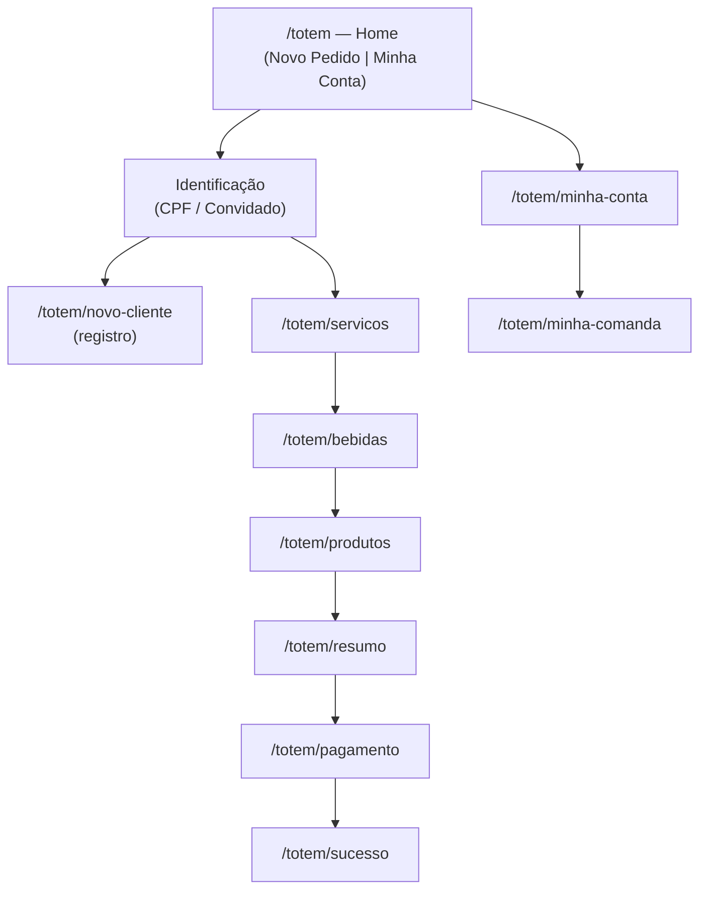

# Lacunas — Navegação e "Voltar ao Início" (Totem)

Documento de lacunas focado na navegação do fluxo do totem, gerado a partir da
leitura de `src/app/totem/*`, `src/components/totem/totem-drawer.tsx`,
`src/hooks/use-comanda.ts` e `src/hooks/use-totem-session.ts`.

> Objetivo: ter, na UI, uma forma consistente de **retornar ao início** em qualquer
> momento do flow, **mantendo a comanda aberta**.

## 1. O fluxo atual (mapa)

## 2. Dois conceitos de "comanda" (fonte da ambiguidade)

| Conceito                   | Onde vive             | Quando existe            | Como persiste                      |
|----------------------------|-----------------------|--------------------------|------------------------------------|
| **Carrinho local**         | `use-comanda` (memória + `sessionStorage["totem-carrinho"]`) | A partir de Serviços     | Sobrevive a recarregamentos        |
| **Comanda aberta (servidor)** | Banco (`status = ABERTA`) | Só no **Resumo** (`handleAbrirComanda`) — cria ou mescla | Persistente por cliente/convidado  |

Consequência: "manter a comanda aberta" só tem significado pleno **depois do Resumo**.
Antes disso, o que existe é apenas o carrinho local. Qualquer ação de "voltar ao início"
precisa definir explicitamente **o que sobrevive** (carrinho? comanda no servidor? ambos?).

## 3. Lacunas identificadas

### L1 — Sem "voltar ao início" consistente em todas as etapas *(principal)*
- Cada página tem botões de volta **ad hoc**, com alvos e semânticas diferentes:
  - Home/Identificação: voltar → muda estado interno (`selection`), não navega.
  - Serviços/Bebidas/Produtos/Resumo/Pagamento: `ArrowLeft` + `FlowStepper`, mas o alvo varia.
  - `Trocar cliente` existe **só** em `/totem/servicos`.
- Não há um único affordance que leve direto à Home (`/totem`) a partir de qualquer etapa.

### L2 — "Trocar cliente" não limpa o carrinho (bug de consistência)
- Em `/totem/servicos`, `Trocar cliente` chama `clearTotemSession()` + `push("/totem")`.
- Mas `clearTotemSession()` **não remove** `totem-carrinho` — só `TOTEM_CLIENTE`, `COMANDA_ID`, `LAST_ACTIVITY`, `GUEST_INFO`.
- Resultado: um cliente novo pode herdar os itens do carrinho do cliente anterior.

### L3 — Timeout de inatividade também não limpa o carrinho
- O `TotemLayout` faz `push("/totem")` ao expirar (5 min), mas **não** chama `limparComanda()`.
- Mesma inconsistência da L2: o carrinho persiste mesmo depois do reset de sessão.

### L4 — Carrinho/carrinho-aberto "desaparece" na Home e no Sucesso
- O `TotemDrawer` (pill do carrinho) é **oculto** em `/totem` e `/totem/sucesso`.
- Ao "voltar ao início", o usuário perde toda indicação visual de que há uma comanda aberta/carrinho pendente — exatamente a informação que o pedido quer preservar.

### L5 — Sem definição clara do destino pós-volta
- O fluxo não distingue "voltar para consultar a comanda" de "começar um novo pedido".
- Escolher "Novo Pedido" após voltar ao início reutiliza (acumula) o carrinho antigo em vez de reiniciar — comportamento implícito, nunca decidido.

### L6 (contexto, do doc anterior) — Estados órfãos
- `reabrir` existe na API mas sem botão; `CANCELADA` inalcançável. Não bloqueia esta feature, mas afeta o ciclo de vida da comanda que queremos "manter aberta".

## 4. Decisões refinadas (via `vscode_askQuestions`)

1. **Posição do controle** → um **cabeçalho padronizado no flow** (a partir de "Novo Pedido"), presente em Serviços, Bebidas, Produtos, Resumo e Pagamento. Implementado como componente compartilhado `src/components/totem/totem-flow-header.tsx`.
2. **Botão "Voltar" (esquerda)** → retorna **1 etapa no flow** (comanda/carrinho intactos). Em Serviços, mantém o rótulo/semântica de "Trocar cliente".
3. **Botão "Continuar depois" (direita)** → **pausa o atendimento**: volta à Home mantendo a comanda aberta. Com diálogo de confirmação ("Sua comanda continua aberta..."). Se já existe `comandaId` no servidor, limpa a sessão local (itens seguros no banco); caso contrário, preserva o carrinho local para não perder itens ainda não persistidos.
4. **O que sobrevive** → carrinho **+** comanda aberta (servidor).
5. **Reinício de pedido** → "Novo Pedido" limpa o carrinho; a comanda aberta anterior segue disponível via Minha Conta.

## 4b. Decisões ainda pendentes (não implementadas)

- **L2/L3** — `clearTotemSession()`/timeout ainda não removem `totem-carrinho`. O "Continuar depois" já preserva o carrinho quando não há comanda no servidor; limpar corretamente em "Trocar cliente"/timeout segue como melhoria separada.
- **L4/L5** — faixa na Home ("Você tem uma comanda aberta — Continuar?") para retomar o flow. Não incluída nesta iteração.

## 6. Pré-preenchimento / edição da comanda aberta (implementado)

Quando o cliente consulta a comanda que já estava aberta e escolhe
**"Adicionar Itens à Conta Existente"**, a tela de Serviços agora abre **com os
serviços existentes já marcados** e funciona em modo de **edição**:

- **Pré-seleção** — `src/app/totem/page.tsx` (`handleContinueWithExisting`) salva os
  `servicoId`s da comanda aberta + o id da comanda no `sessionStorage`
  (`totem-resume-servicos`, `totem-resume-comanda`).
- **Modo edição** — `src/app/totem/servicos/page.tsx` lê esses valores e:
  - pré-seleciona os serviços que já estavam na comanda;
  - ao continuar, **desmarcar** um serviço existente o **remove da comanda** via
    `DELETE /api/comandas/{id}/itens?servicoId=...&quantidade=N`;
  - **marcar** novos os adiciona ao carrinho (que é mesclado no Resumo). Assim os
    existentes não são duplicados.
- **Novo endpoint** — `DELETE` em `src/app/api/comandas/[id]/itens/route.ts`: remove
  `quantidade` unidades de um item (por `servicoId`/`bebidaId`/`produtoId`), decrementa a
  quantidade (ou exclui o item) e recalcula o total da comanda. Só age sobre comandas `ABERTA`.

> Nota: o pré-preenchimento cobre **serviços** (a etapa em que a feature foi pedida).
> Bebidas/produtos de uma comanda aberta ainda não são re-hidratados nas respectivas
> etapas — segue como extensão natural do mesmo padrão.

## 5. Impactos prováveis da implementação (rascunho)

- Novo componente global no `TotemLayout` (ex.: botão fixo) disponível em todas as etapas do flow.
- Ajuste em `use-totem-session.ts` / `use-comanda.ts` para um helper de "voltar ao início" que preserve o estado desejado e, se necessário, limpe o carrinho corretamente (resolve L2/L3 de brinde).
- Possível mostrar na Home uma faixa "Você tem uma comanda aberta — continuar?" (mitiga L4/L5).
